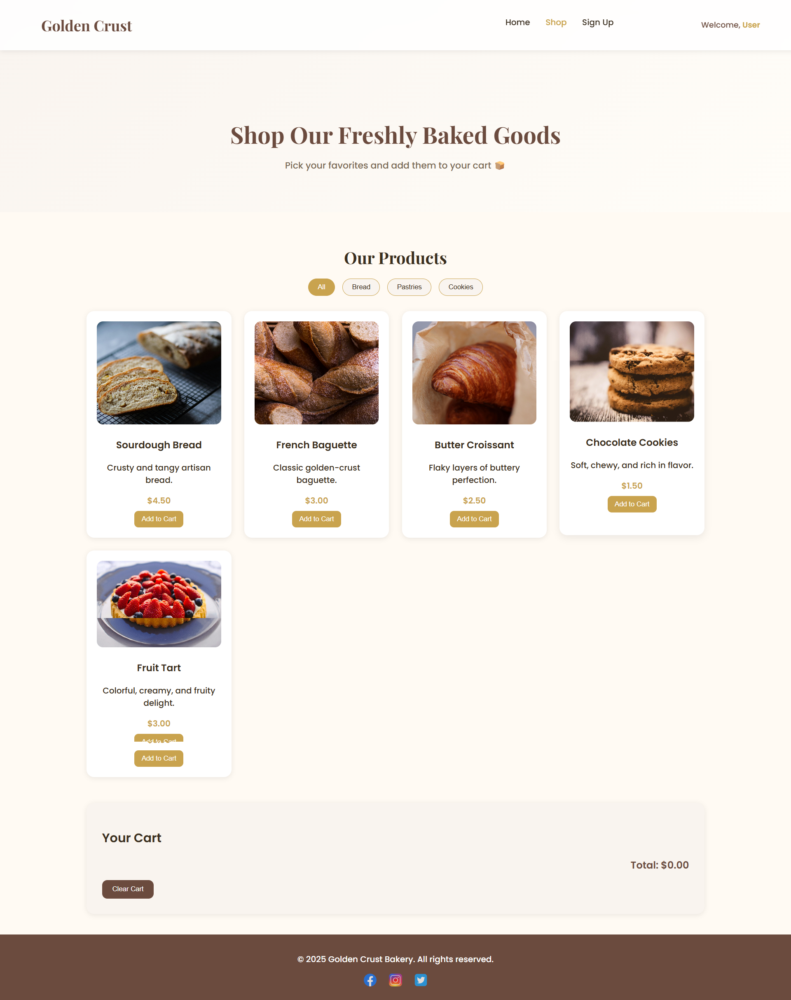
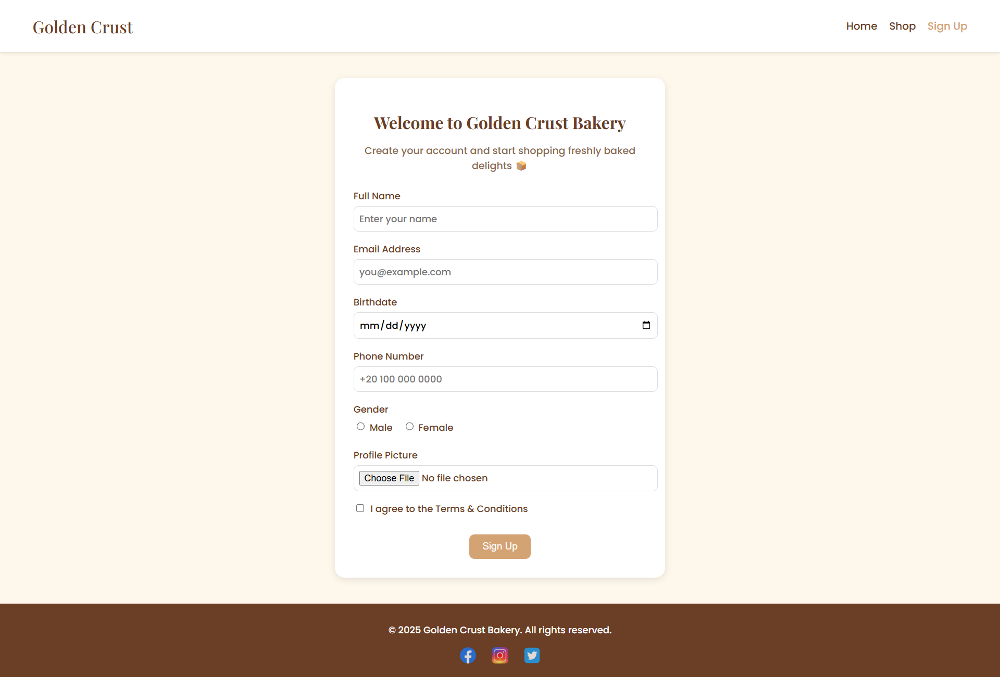

# 🍞 Golden Crust Bakery Website

A creative, responsive bakery website showcasing artisan breads, pastries, and online shopping functionality. This project is built with HTML, CSS, and JavaScript, and is suitable for portfolio use.

---

## 📝 Features

### Home Page (`index.html`)
- Hero header with bakery tagline.
- Sections:
  - **Our Signature Breads** – Gallery of artisan breads.
  - **Pastries & Sweets** – Featured pastries with images and descriptions.
  - **Services** – Custom cakes, delivery, catering (with background images and overlay).
  - **About** – Bakery story with image.
  - **Contact** – Address, phone, hours.
- Navigation bar with links to all sections and shopping page.
- Sticky navbar with username display after sign-up.

### Shop Page (`shop.html`)
- Browse bakery products: breads, pastries, cookies.
- Filter products by category.
- Add items to shopping cart with "Add" button.
- Cart displays total and allows clearing items.
- Welcome message showing signed-in user's name.
- Responsive design matching the main site.

### Sign-Up Page (`form.html`)
- User registration form:
  - Name, email, birthdate, phone number, gender, profile picture.
  - Terms & conditions checkbox (required).
- Saves username in `localStorage`.
- Redirects to Shop page after successful sign-up.
- Compact card design for all screen sizes.


---

## 🎨 Technologies Used

- **HTML5** – Structure of all pages.
- **CSS3** – Styling, responsive design, hover effects, overlay backgrounds.
- **JavaScript** – Interactive cart functionality, form handling, localStorage for username.
- **Google Fonts** – Playfair Display & Poppins.
- Images sourced from local `images/` folder.

## 🖼 Screenshots

<!-- Add your screenshots here -->
<!-- Example Markdown format -->

### Home Page


### Shop Page


### Sign-Up Page


---

## 📂 File Structure
Golden-Crust-Bakery/
│
├─ index.html
├─ shop.html
├─ form.html
├─ style.css
├─ shop.css
├─ form.css
├─ images/
│ ├─ sourdough.jpg
│ ├─ rye-bread.jpg
│ ├─ baguette.jpg
│ ├─ brown-bread.jpg
│ ├─ multigrain.jpg
│ ├─ olive-bread.jpg
│ ├─ croissant.jpg
│ ├─ cookies.jpg
│ ├─ tart.jpg
│ ├─ Custom-Cakes.jpg
│ ├─ Delivery.jpg
│ ├─ Catering.jpg
│ └─ social media icons...
└─ README.md


---

## 🚀 How to Run Locally

1. Clone the repository:
   ```bash
   git clone https://github.com/your-username/golden-crust-bakery.git


Navigate to the project folder:

cd golden-crust-bakery


Open any HTML file (index.html, shop.html, or form.html) in your browser.

📌 Notes

The username entered in the Sign-Up page is saved in localStorage and used across pages for a personalized welcome message.

All images should remain in the images/ folder for paths to work correctly.

Responsive design ensures usability on desktop and tablet devices.

Author

Rania Abdelnasser– Frontend Developer

